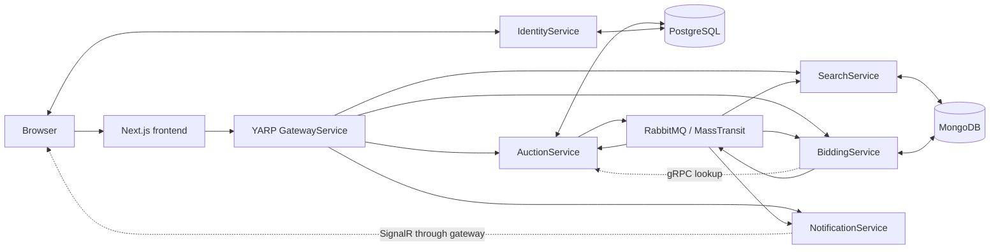

# DriveBid: Real-Time Auction Application

DriveBid is a vehicle auction application built with .NET microservices and a Next.js frontend. Users can list vehicles, search auctions, and place bids, with live updates as bids come in.

The repository retains the name `Auction_App_Using_Microservices`, and the solution and local development domains retain the original `Carsties` naming.

## Implemented features

- Create, update, delete, search, and filter vehicle auctions.
- Authenticate users through a dedicated identity service.
- Submit bids with seller, auction-end, current-bid, and reserve-price checks.
- Update auction displays through SignalR events.
- Detect finished auctions in a background service and publish their results.

## Architecture and workflow

| Component | Responsibility |
| --- | --- |
| [Next.js frontend](frontend/web-app) | Auction browsing, forms, authentication, bid submission, and live UI updates. |
| [GatewayService](src/GatewayService) | YARP routing to auction, search, bidding, and notification services; authorization policies for write routes. |
| [AuctionService](src/AuctionService) | Auction records in PostgreSQL, auction APIs, a gRPC lookup, and an Entity Framework/MassTransit outbox. |
| [BiddingService](src/BiddingService) | Bid evaluation and storage in MongoDB; a background check for completed auctions. |
| [SearchService](src/SearchService) | MongoDB search data initialized from AuctionService and updated by events. |
| [IdentityService](src/IdentityService) | ASP.NET Core Identity and Duende IdentityServer, backed by PostgreSQL. |
| [NotificationService](src/NotificationService) | Consume auction and bid events and broadcast them through SignalR. |
| [Contracts](src/Contracts) | Shared auction and bid event definitions. |



The Docker configuration also includes an nginx reverse proxy for the frontend, identity, and gateway HTTPS hostnames. PostgreSQL and MongoDB each host separate application databases for the services that use them.

### What happens when a user bids?

1. The frontend's server action submits the auction ID and amount to the gateway's `POST /bids` route, which forwards to BiddingService's `POST /api/bids` endpoint.
2. BiddingService reads its local auction data. If absent, it requests the auction from AuctionService over gRPC; an unavailable auction produces a bad-request response.
3. The service prevents seller self-bidding and assigns a bid status using the auction end time, highest bid, and reserve price.
4. It saves the bid in MongoDB, publishes `BidPlaced`, and returns the bid result.
5. AuctionService and SearchService consume the event to update their auction views. NotificationService broadcasts it, and the frontend updates the displayed price and bid history.

See the [bid controller](src/BiddingService/Controllers/BidsController.cs), [frontend action](frontend/web-app/app/actions/auctionActions.ts), and [SignalR provider](frontend/web-app/app/providers/SignalRProvider.tsx).

Event-driven views update asynchronously. AuctionService configures a database outbox; this should not be read as an outbox guarantee for every service. SearchService also implements retries for its initial HTTP synchronization and auction-created consumer. Bid persistence and event publishing are separate operations in the current bidding implementation.

## Setup and usage

### Prerequisites

- Git and Docker with the Docker Compose plugin, configured for Linux containers.
- Local DNS/hosts-file access and trusted development certificates for the three hostnames below.
- .NET 8 SDK for running backend tests outside Docker.
- Node.js and npm for optional frontend checks; the current frontend Dockerfile uses Node.js 18.

### Run the Docker environment

```bash
git clone https://github.com/raziullah7/Auction_App_Using_Microservices.git
cd Auction_App_Using_Microservices
```

Add this entry to your operating system's hosts file:

```text
127.0.0.1 app.carsties.local id.carsties.local api.carsties.local
```

Provide a locally trusted certificate and key covering those names at `devcerts/carsties.local.crt` and `devcerts/carsties.local.key`, matching the existing nginx mount. For example, after installing [mkcert](https://github.com/FiloSottile/mkcert), generate your own local certificate from the repository root:

```bash
mkcert -install
mkcert -cert-file devcerts/carsties.local.crt -key-file devcerts/carsties.local.key "*.carsties.local" carsties.local
```

Keep generated private keys local. Review the development configuration in [docker-compose.yml](docker-compose.yml), including database connection strings, identity URLs, and `AUTH_SECRET`, before starting. The checked-in configuration is for local development.

```bash
docker compose up -d --build
docker compose ps
docker compose logs -f
```

Open `https://app.carsties.local`. Identity uses `https://id.carsties.local`, and the gateway uses `https://api.carsties.local`. Local ports 80/443, database ports, and the service ports declared in Compose must be available. Inspect service logs if dependencies are still starting.

For frontend-only development commands, see the existing [frontend README](frontend/web-app/README.md). Its development server also requires reachable backend services and matching authentication configuration.

## Existing checks

Run from the repository root:

```bash
dotnet test tests/AuctionService.Unit.Tests/AuctionService.Unit.Tests.csproj
dotnet test tests/AuctionService.IntegrationTests/AuctionService.IntegrationTests.csproj
dotnet test tests/SearchService.IntegrationTests/SearchService.IntegrationTests.csproj
```

- **Auction unit tests:** controller responses, ownership checks, and entity behavior.
- **Auction integration tests:** HTTP responses, authentication/authorization, persistence, and auction-created event publishing. These use PostgreSQL Testcontainers, so Docker must be running.
- **Search integration tests:** auction-created event consumption and MongoDB persistence, using Mongo2Go and the MassTransit test harness. The environment must support Mongo2Go's database process.

Frontend scripts are defined in [package.json](frontend/web-app/package.json):

```bash
cd frontend/web-app
npm ci
npm run lint
npm run build
```

## Current status

This repository demonstrates a distributed auction application with separate service responsibilities, messaging, gRPC, and real-time UI updates. The setup and checks above were documented from the source; they were not executed during this documentation refresh. The existing tests cover selected services and behaviors, rather than the complete application end to end.
